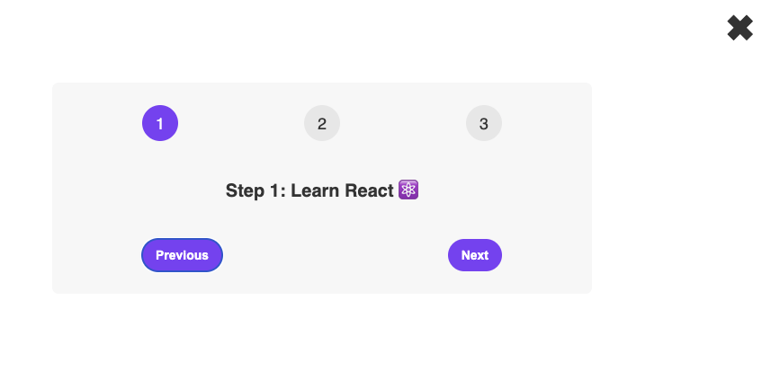

# Steps - React Learning Project

Interactive step component demonstrating core React concepts.



## 🎯 React Concepts Learned

- **useState Hook**: State management for step counter and component visibility
- **Event Handling**: onClick events for button interactions
- **Conditional Rendering**: Showing/hiding UI based on state (`{isOpen && ...}`)
- **Functional Components**: Modern React component structure
- **State Updates**: Using setState with previous state (`setStep(s => s-1)`)
- **React Fragments**: Using `<>` to return multiple elements

## 🚀 Installation

```bash
npm install
npm start
```
Open [http://localhost:3000](http://localhost:3000)

## 📁 Project Structure

```
src/
├── App.js       # Main step component
├── index.js     # React entry point
└── index.css    # Styling
```

## ⚡ How This Project Works

**React State Management:**
- Two `useState` hooks: `step` (tracks current step 1-3) and `isOpen` (controls visibility)
- State updates trigger re-renders to update UI

**Component Behavior:**
- Previous/Next buttons update step state with boundary checks
- Close button toggles component visibility using conditional rendering
- Active step styling applied based on current state value

**React Patterns Demonstrated:**
- Functional component with hooks
- Event handlers that modify state
- Conditional rendering with `&&` operator
- State-driven UI updates
